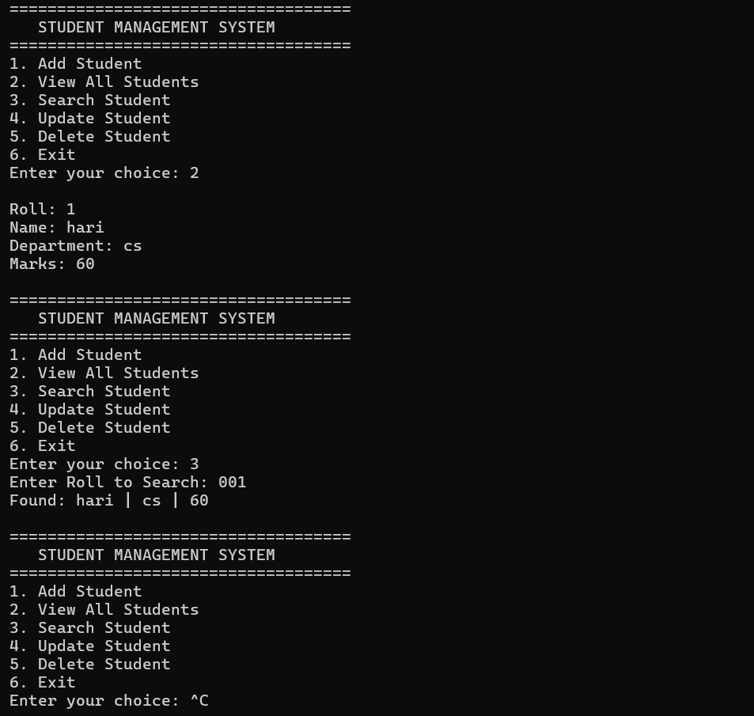

# Student Management System (C++)



A **console-based Student Management System** developed in C++ that allows users to **Add, View, Search, Update, and Delete student records**. This project demonstrates **Object-Oriented Programming (OOP)**, **file handling**, and **STL (vectors & algorithms)** in C++.

---

## 📋 Features

- **Add Student** – Add new student records with Roll, Name, Department, and Marks.  
- **View All Students** – Display all students in a structured table.  
- **Search Student** – Search for a student using Roll number.  
- **Update Student** – Update details of an existing student.  
- **Delete Student** – Remove student records by Roll number.  
- **Persistent Storage** – Data is saved in a text file (`students.txt`) to retain records.

---

## ⚙️ Requirements

- **C++ Compiler** (g++, Visual Studio, or Code::Blocks)  
- **Operating System**: Windows, Linux, or macOS  
- Basic knowledge of terminal/command line  

---

## 💻 Installation & Run

1. **Clone the repository:**

```bash
git clone https://github.com/YourUsername/StudentManagement.git
cd StudentManagement

Compile the project:
# g++ main.cpp Student.cpp FileHandler.cpp -o sms -std=c++11

Run the program:
./sms   # Linux / Mac
sms.exe # Windows


